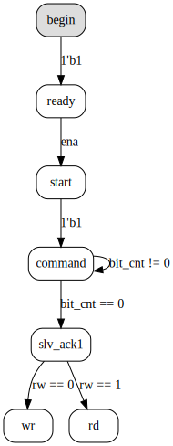

# Examples

### Quadrature encoder FSM

```js
{
  clock: 'clk',
  asyncReset: '~reset_n',
  condition: '{a, b}',
  draw: 'dot', // circo, dot
  ascii: true,
  states: {
    start: {s00: "2'b00", s01: "2'b01", s11: "2'b11", s10: "2'b10"},
    s00:   {s01: "2'b01", s10: "2'b10", error: "2'b11"},
    s01:   {s11: "2'b11", s00: "2'b00", error: "2'b10"},
    s11:   {s10: "2'b10", s01: "2'b01", error: "2'b00"},
    s10:   {s00: "2'b00", s11: "2'b11", error: "2'b01"},
    error: {}
  }
}
```


In Verilog: [quadrature.v](quadrature.v#L7-L20)

### JTAG FSM

```js
{
  name: 'J',
  condition: 'tms',
  clock: 'tck',
  syncReset: 'treset',
  states: [
    // skewers
    {name: 'testLogicReset', next: {runTest: 0}},
    {name: 'runTest'},

    {name: 'selectDR',  next: {captureDR: 0}},
    {name: 'captureDR', next: {shiftDR:   0}},
    {name: 'shiftDR',   next: {exit1DR:   1}},
    {name: 'exit1DR',   next: {pauseDR:   0}},
    {name: 'pauseDR',   next: {exit2DR:   1}},
    {name: 'exit2DR',   next: {updateDR:  1}},
    'updateDR',

    {name: 'selectIR',  next: {captureIR: 0}},
    {name: 'captureIR', next: {shiftIR:   0}},
    {name: 'shiftIR',   next: {exit1IR:   1}},
    {name: 'exit1IR',   next: {pauseIR:   0}},
    {name: 'pauseIR',   next: {exit2IR:   1}},
    {name: 'exit2IR',   next: {updateIR:  1}},
    'updateIR',

    // bridge
    {name: 'runTest',   next: {selectDR:       1}},
    {name: 'selectDR',  next: {selectIR:       1}},
    {name: 'selectIR',  next: {testLogicReset: 1}},

    // DR
    {name: 'captureDR', next: {exit1DR:  1}},
    {name: 'exit1DR',   next: {updateDR: 1}},
    {name: 'exit2DR',   next: {shiftDR:  0}},
    {name: 'updateDR',  next: {runTest:  0, selectDR: 1}},

    // IR
    {name: 'captureIR', next: {exit1IR:  1}},
    {name: 'exit1IR',   next: {updateIR: 1}},
    {name: 'exit2IR',   next: {shiftIR:  0}},
    {name: 'updateIR',  next: {runTest: 0, selectIR: 1}}
  ]
}
```


In Verilog: [jtag.v](jtag.v#L6-L49)

### I2C Slave FSM

```js
{
  registers: {
    started: 1,
    bit_cnt: {width: 8, init: 8},
    phase: 2 // width
  },
  states: [{
    name: 'begin', style: 'filled,rounded', fillcolor: '#dddddd',
    next: [
      {name: 'ready', condition: "1'b1", actions: {started: "1'b1"}}
    ]
  }, {
    name: 'ready',
    next: {
      start: 'ena'
    }
  }, {
    name: 'start',
    next: {
      command: "1'b1"
    }
  }, {
    name: 'command',
    onEntry: {
      bit_cnt: 8,
      phase: 1
    },
    next: [
      {name: 'slv_ack1', condition: 'bit_cnt == 0'},
      {name: 'command',  condition: 'bit_cnt != 0', actions: {bit_cnt: 'bit_cnt - 1'}}
    ]
  }, {
    name: 'slv_ack1',
    next: [
      {name: 'wr', condition: "rw == 0"},
      {name: 'rd', condition: "rw == 1"}
    ]
  }, {
    name: 'wr', onEntry: {phase: 2}, onExit: {phase: 42}
  }, {
    name: 'rd', onExit: {phase: 3}, onSelf: {phase: 33}
  }]
}
```



In Verilog: [i2c_slave.v](i2c_slave.v#L6-L48)
